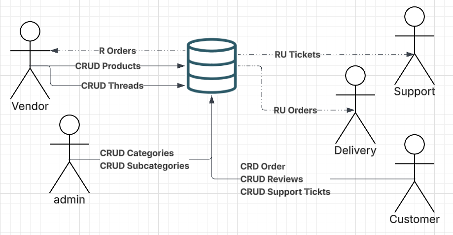
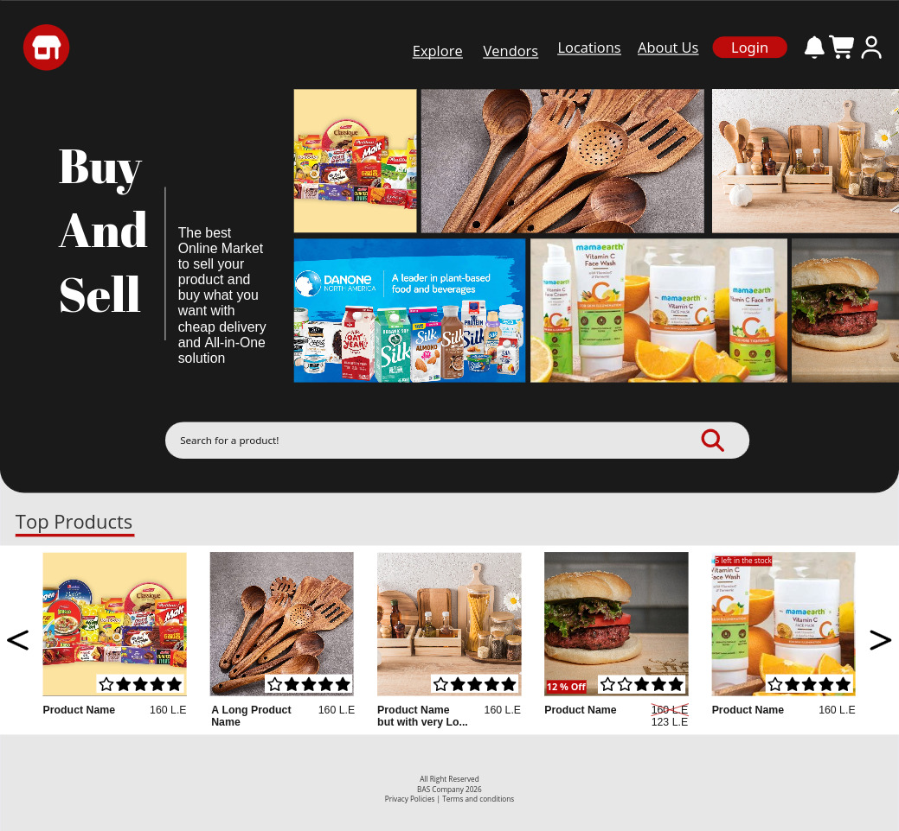
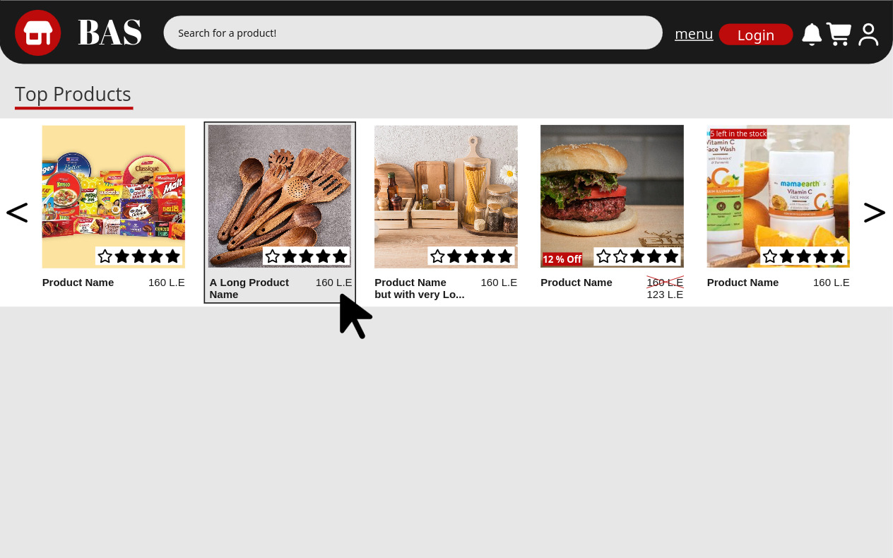
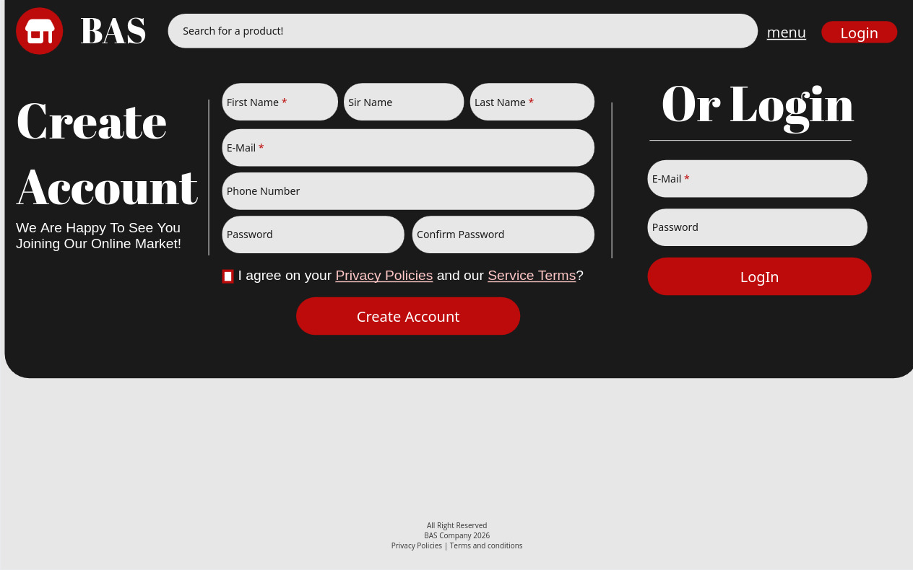

# Software Requirement Specification
# For BAS (Buy And Sell)

version 0.0.1

Community Driven

8 Feb 2026, 8 Feb 2026

Prepared By Mohammed Saleh

---

# Table of content
- [Revision History.](#revision-history)
1. [Introduction.](#1-introduction)
    - 1.1 [Purpose.](#11-purpose)
    - 1.2 [Document Conventions.](#12-document-conventions)
    - 1.3 [Intended Audience and Reading Suggestions.](#13-intended-audience-and-reading-suggestions)
    - 1.4 [Product Scope.](#14-product-scope)
    - 1.5 [References.](#15-references)
2. [Overall Description.](#2-overall-description)
    - 2.1 [Product Perspective.](#21-product-perspective)
    - 2.2 [Product Functions.](#22-product-functions)
    - 2.3 [User Classes and Characteristics.](#23-user-classes-and-characteristics)
    - 2.4 [Operating Environment.](#24-operating-environment)
    - 2.5 [Design and Implementation Constraints.](#25-design-and-implementation-constraints)
    - 2.6 [User Documentation](#26-user-documentation)
    - 2.7 [Assumptions and Dependencies](#27-assumptions-and-dependencies)
3. [External Interface Requirements](#external-interface-requirements)
    - 3.1 [User Interfaces](#31-user-interfaces)
    - 3.2 [Hardware Interfaces](#32-hardware-interfaces)
    - 3.3 [Software Interfaces](#33-software-interfaces)
    - 3.4 [Communications Interfaces](#34-communications-interfaces)
4. [System Features](#system-features)
    - 4.1 [System Feature 1](#41-system-feature-1)
    - 4.2 [System Feature 2 (and so on)](#42-system-feature-2-and-so-on)
5. [Other Nonfunctional Requirements](#other-nonfunctional-requirements)
    - 5.1 [Performance Requirements](#51-performance-requirements)
    - 5.2 [Safety Requirements](#52-safety-requirements)
    - 5.3 [Security Requirements](#53-security-requirements)
    - 5.4 [Software Quality Attributes](#54-software-quality-attributes)
    - 5.5 [Business Rules](#55-business-rules)
6. [Other Requirements](#other-requirements)
    - [A: Glossary](#appendix-a-glossary)
    - [B: Analysis Models](#appendix-b-analysis-models)
    - [C: To Be Determined List](#appendix-c-to-be-determined-list)
---
# Revision History

|   Name    |    Date    |  Reason For Changes  |   Version |
|:----------|:-----------|:---------------------|:----------|
|_          |_           |_                     |_          |
|_          |_           |_                     |_          |
|_          |_           |_                     |_          |
|_          |_           |_                     |_          |

---

# 1. Introduction
## 1.1 Purpose
This SRS is for an **Amazon** clone called **BAS** (*B*uy *A*nd *S*ell), it is an online market, where the Vendor/Seller/Shop will add products aand the customer can descover this products and order them, we will buy this product from this vendor and deliver it to the customer, both of vendoers and customers can monitor the shipping and delivering process, pay online or on door.

## 1.2 Document Conventions
- **Bold** for naming.
- *Italic* for highlighting.
- ~~underline~~ for the changed content.
- CRUD refarres to **C**reat,**R**ead ,**U**pdate** and **D**elete.

## 1.3 Intended Audience and Reading Suggestions
hmmmm, developers ofc.

## 1.4 Product Scope
This project will lead to make it easire to do shopping, no need to go outside, you can register and start buying from the products which the vendor added or being a vendor and add products, stay at your home and we will delive it to your door.

We will share with the vendor some amount of his benifits from selling this items and delivry price from the user.

## 1.5 References
the only refrence is **Amazone** since it is what we are cloning with a modern UI and mocking data lol.

IEEE Std 830-1998, IEEE Recommended Practice for Software Requirements Specifications.

# 2. Overall Description
## 2.1 Product Perspective
this project is just a clone of amazone, and this is the main objects
- Users
    - Custormer
        - Make _Orders_.
        - Discover *Products*.
        - have a *Cart*, *WishList* and *Review score* for ordered products
        - Make *reviews* and start *Threads*
        - Start a *Support Tickets*
    - Vendor
        - Add *Products*.
        - Review *Orders*.
        - Review *Delivery Workers*.
    - Admin
        - Make *Categories* and *Subcategories*
        - have *full access* to the whole system.
    - Support
        - Review and replay on *Support Tickets*.
    - Delivery
        - Review the Orders in his location.
        - update for delivered products.
- Products and Sub Products
- Notifications and Locations

## 2.2 Product Functions

## 2.3 User Classes and Characteristics
I will rate from 4.
|   user    |   visit requent   |   Access level    |   Importance  |
|:----------|:------------------|:------------------|:--------------|
| Customer  |       4           |   1               |   4           |
| Vendor    |       3           |   2               |   3           |
| Delivery  |       3           |   2               |   3           |
| Support   |       2           |   2               |   2           |
| Admin     |       1           |   4               |   1           |

## 2.4 Operating Environment
- Hardware: Mostly VPS providers, ex: **Orecal** or **Lightsteal AWS**.
- Software:
    - OS: Debian/Ubuntu Latest Version.
    - Web Server and Routes: Apache/Ngix Latest Version.
    - Backend Engine: PHP-fpm 8.4 (Latest).
    - Database: PostgreSQL 18 (Latest).
    - HTTPS Reverse Proxy: Caddy (Latest).
    - Web AI Firewall: Anubis (External).
    - Emails: External API Integration or SMTP (latest).
    - SMS: External API Integration.
    - Payment: External API Integration.
    - Maps API
    - Real-Time Notifications: Node.js unit (I am lying) / External API Integration.

## 2.5 Design and Implementation Constraints
|   Technology    |                 Type                |               why?                    |
|:----------------|:------------------------------------|:--------------------------------------|
| HTML            | Markup Langueage                    | Frontend structure                    |
| CSS             | Cascade Style Sheet                 | Frontend Styles                       |
| JavaScript      | Scripting Langueage                 | Actions in frontend                   |
| Tailwind        | CSS Utilty                          | Build CSS based on class name         |
| npm             | Node Package Manager                | Build Tailwind Class                  |
| JQuery          | JavaScript Library                  | DOM actions and API calls             |
| PHP-fpm         | Scripting Langueage                 | Build the Backend Engain              |
| OOP             | Writing Code Phylosiphy             | Make a maintainable backend engien    |
| MVC             | file structure and code writing way | Dont Repeat Yourself, clean URLs      |
| Composer        | PHP Package Manager                 | classes namespaces, some packages     |
| Docker          | Container                           | Environment to run the code on        |
| Git             | Version Controler                   | Version Mangment and teamwork         |
| GitHub/Gitea    | Git Host                            | Hosting the source code               |
| Linux           | Operating System                    | wtf? dont know why? leave windows     |
| PHPSTORM        | PHP IDEA                            | Writing the code                      |
| XDEBUG          | PHP Debugger                        | monitor code flow, variables values   |
| Chromium        | Web Browser                         | Test the code                         |
| PostgreSQL      | DataBase                            | Store the data                        |
| LucidChart      | Drawing Diagrams App                | Drawing Digarams and UMLs             |
| drawdb.io       | Database Drawing webapp             | Prepareing the schema, create SQL code|
|   PgAdmin      | PHP admin for PostgreSQL            | Managing the Database                 |
| Anubis          | Web AI Firewall                     | prevent DDoS and Bad Quality Requests |
| Nginx          | Web server                          | hosting and routing                   |
| Extrnal APIs    | Integrations with external services | for SMS, Mails, Payment and real-time Notificatiosn|

## 2.6 User Documentation
- API Refrences
    - full documentation for the API and how to deal with it. system can be used from the frontend webapp or postman.
- Developer Guide
    - `README.md` files, `PHPDocs` and comments to help develoeprs understand what is going and make it easire for them to contribute.
- In-App guide
    - user will have a guide (maybe will be in the left side or with `?` icon) explain to him what is going and what should he do.

## 2.7 Assumptions and Dependencies
- Captcha
- SMS
- Real-Time notifications
- Maps
- E-Mail
- PayMob
- Instapay
- ID verify

# External Interface Requirements
## 3.1 User Interfaces

![[product]](./product.jpg)

## 3.2 Hardware Interfaces
Amazon Lightseal

## 3.3 Software Interfaces
- The project is a website, will run on any browser.
- PostgreSQL databse, will use my own ORM engine.
- API Integrations for:
    - Maps
    - Location
    - Notifications
    - Payment
    - Emails
    - SMS
    - Anubis web Firewall
- Tailwind, JQuery

## 3.4 Communications Interfaces
- HTTPS in Web Browser to Access the Web page and the API

# System Features
## 4.1 Register
### 4.1.1 Description and Priority
- High Priority.
- allows users to create accounts to use our service
### 4.1.2 Stimulus/Response Sequences
- user inserts his:
    - full name *
    - email *
    - country phone code 
    - phone number 
    - password *
    - Captha *
    - Agree on service terms
- System Checks the input and respond
    - full name must be 5 ~ 255 char
    - valid email
    - valid country code
    - valid phone number
    - validate the captcha
    - more than 8 chars password
    - accept the terms of usage and privacy policies
    - if email and phone is not used before, if used, redirect to forget password
- for 2FA
    - save the code that user added to his authinticator
    - save recovery phases

### 4.1.3 Functional Requirements
- authentication
- verification
- notifications 

    To Be Continude ...
    <!--
## 4.2 Choose Role
### 4.2.1 Description and Priority
- High Priority.
- after user register, he need to pick a role, customer, vendor or delivery.
### 4.2.2 Stimulus/Response Sequences
- Ask the user for his role
    - if normal user, finish
    - if a vendor
        - ask the user to add this info
            - add store name
            - choose store categories and subcategories (Many)
            - add physical addresses (Many)
            - add social media and website (Many)
            - add working hours
        - if something not valid? return with descriptive error, save last inputs
        - Ask if vendor have another store to add
        - Ask if the inserted phone have instapay or not, if not ask to add.
        - if something not valid? return with descriptive error, save last inputs
    - if Delivery
        - add Vehicals if he have
        - add city
        - select supported range from a map
        - add aviliblty hours
        - Ask if the inserted phone have instapay or not, if not ask to add.
        - Upload Nation ID with both faces
        - if something not valid? return with descriptive error, save last inputs
- if something not valid? return with descriptive error, save last inputs
- after finishing, redirect user to home page with his profile and enable all features for his role
- if user is vendor or delivery, wait for admin approval.
- send notification for admin to approve vendors and delivery.
- send welcome email to the new user.
### 4.2.3 Functional Requirements
- Choices
- gather information
- notify admin
- get nation id
- welcome message

# Other Nonfunctional Requirements
## 5.1 Performance Requirements

    If there are performance requirements for the product under various circumstances, state them here and explain their rationale, to help the developers understand the intent and make suitable design choices. Specify the timing relationships for real time systems. Make such requirements as specific as possible. You may need to state performance requirements for individual functional requirements or features.

## 5.2 Safety Requirements

    Specify those requirements that are concerned with possible loss, damage, or harm that could result from the use of the product. Define any safeguards or actions that must be taken, as well as actions that must be prevented. Refer to any external policies or regulations that state safety issues that affect the product’s design or use. Define any safety certifications that must be satisfied.

## 5.3 Security Requirements

    Specify any requirements regarding security or privacy issues surrounding use of the product or protection of the data used or created by the product. Define any user identity authentication requirements. Refer to any external policies or regulations containing security issues that affect the product. Define any security or privacy certifications that must be satisfied.

## 5.4 Software Quality Attributes

    Specify any additional quality characteristics for the product that will be important to either the customers or the developers. Some to consider are: adaptability, availability, correctness, flexibility, interoperability, maintainability, portability, reliability, reusability, robustness, testability, and usability. Write these to be specific, quantitative, and verifiable when possible. At the least, clarify the relative preferences for various attributes, such as ease of use over ease of learning.

## 5.5 Business Rules

    List any operating principles about the product, such as which individuals or roles can perform which functions under specific circumstances. These are not functional requirements in themselves, but they may imply certain functional requirements to enforce the rules.

# Other Requirements

    Define any other requirements not covered elsewhere in the SRS. This might include database requirements, internationalization requirements, legal requirements, reuse objectives for the project, and so on. Add any new sections that are pertinent to the project.

## Appendix A: Glossary

    Define all the terms necessary to properly interpret the SRS, including acronyms and abbreviations. You may wish to build a separate glossary that spans multiple projects or the entire organization, and just include terms specific to a single project in each SRS.

## Appendix B: Analysis Models

    Optionally, include any pertinent analysis models, such as data flow diagrams, class diagrams, state-transition diagrams, or entity-relationship diagrams.

## Appendix C: To Be Determined List

    Collect a numbered list of the TBD (to be determined) references that remain in the SRS so they can be tracked to closure.
